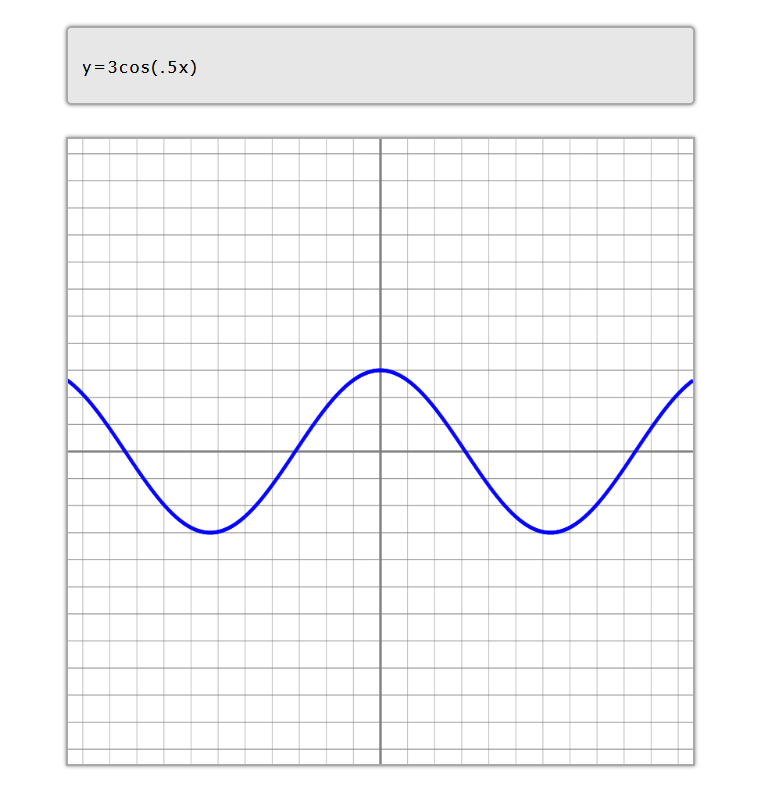

# Phobos
A simple calculator and graphing tool.

## Use
To use the calculator, go to https://lurnie.github.io/phobos/.

To calculate something, type in the box above the graph. To graph an equation, type y= into the graph.

You can use +, -, *, /, ^, along with the functions sin, cos, tan, floor, ceil, round, log, ln, sqrt, cbrt, abs, and sign. You can also use the constants e and pi, and the variable x if you are graphing an equation.

Note that the trigonometric functions take radians as their input. To convert an angle in degrees to an angle in radians, multiply the degrees by pi/180.

## How it works
The lexer goes through the input and finds all the tokens. Then, the tokens are put into a tree structure using a recursive parser. Lastly, the calculator goes through the tree and calculates the final result.

## Known bugs
- Some equations flicker or are slightly inaccurate due to the lack of precision
- Equations that increase or decrease too quickly can disappear